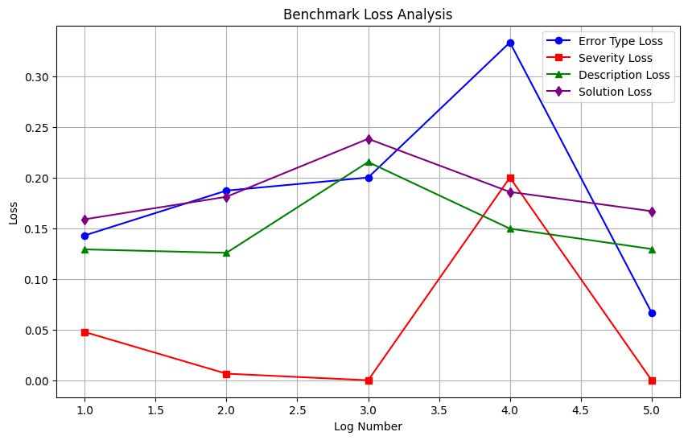
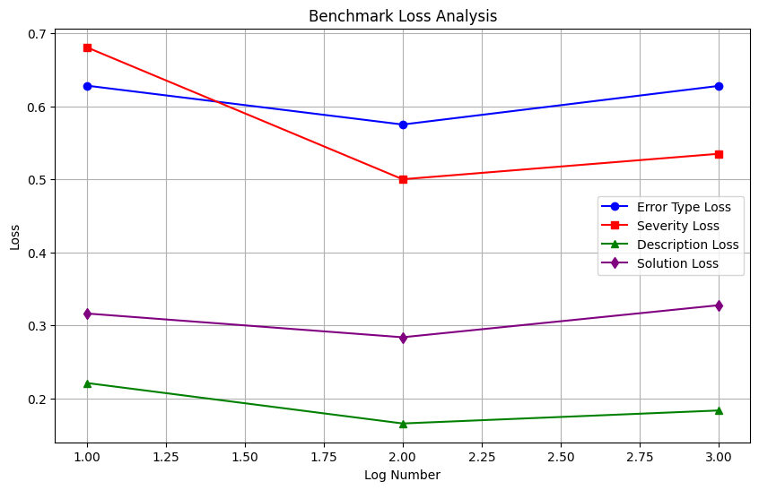

# Shallow Search: Evaluating Deepseek R1 for Apache Error Log Analysis and Error Resolution

## Quickstart

Create a `.env` file at the project root directory to store the following API keys:

```
X_OPENAI_API_KEY="<OPENAI API KEY>"
X_GROQ_API_KEY="<GROQ API KEY>"
```

Using pip:

```
pip install -r requirements.txt
python main.py <model_to_evaluate>
```

where `model_to_evaluate` can be:

- `gpt4o`
- `deepseek-70b-llama-groq`

## Abstract

The objective of this study was to evaluate the performance of large language models (LLMs) in generating synthetic data for descriptions and solutions in Apache error logs while using reinforcement learning methodologies. Specifically, we examined DeepSeek R1, a reinforcement learning-enhanced model that is a distilled off of Groq’s LLaMA 70B. The study employed cosine similarity to assess the correctness of generated outputs against a labeled dataset and incorporated n-gram analysis to refine prompts. We observed significant model biases in sequential text processing and a dependency between severity misclassification and increased loss in description/solution generation. The results highlight limitations in distinguishing between similar error categories and the impact of overfitting in prompt design.

Keywords: Large Language Models, DeepSeek R1, Apache Error Logs, Reinforcement Learning, Prompt Optimization, Cosine Similarity

## Introduction

Large Language Models (LLMs) have demonstrated strong capabilities in understanding and generating natural language, but their performance varies significantly based on task-specific nuances. In system administration and software diagnostics, automated log interpretation is critical for debugging and anomaly detection. However, log entries can be highly ambiguous, requiring contextual understanding beyond simple pattern matching. This study investigates the application of DeepSeek R1, a reinforcement learning-trained LLM, to generate accurate explanations for Apache error logs.

DeepSeek R1 incorporates reinforcement learning to improve reasoning, making it an ideal candidate for structured tasks like log analysis. However, prior research on mathematical reasoning (DeepSeekMath) and compressed inference (LLMLingua) suggests that model efficiency and accuracy trade-offs may exist. Our approach focuses on evaluating how well DeepSeek R1 interprets logs by assessing its ability to identify error types, severity levels, and corresponding resolutions. By comparing DeepSeek R1 to a distilled variant of LLaMA 70B, we examine how different model architectures handle structured log data.

## Methodology

### Data Preprocessing and N-Gram Analysis

We utilized a Python-based approach to analyze actual logs and extract the most common n-grams using the Natural Language Toolkit (NLTK). Specifically, we identified consecutive n-grams ranging from unigrams (1-gram) to fourteen-grams (14-gram). These extracted n-grams were manually analyzed from a linguistic perspective and integrated into the prompts to ensure that the output accurately reflected the most frequently occurring patterns in the logs.

### Model Distillation and Reinforcement Learning

DeepSeek R1, a reinforcement learning-enhanced model, was distilled from Groq’s LLaMA 70B. The distillation process involved training a smaller, more efficient model while transferring knowledge from the larger LLaMA 70B model. To enhance DeepSeek R1’s performance, we applied manual reinforcement learning by systematically reviewing its outputs and removing incorrect responses. This was necessary due to inconsistencies in how DeepSeek classified errors; for instance, it often misclassified actual errors as non-errors.
We observed that DeepSeek R1 struggled with short phrases, such as “Done...”, which negatively impacted classification accuracy. As a mitigation strategy, we employed few-shot prompting by providing each enumeration (enum) field with 4-5 guiding examples to improve response reliability.

### Prompt Optimization and Performance Benchmarking

DeepSeek R1:1.5B (local Ollama) exhibited significantly worse performance on enum fields, with a loss increase of approximately 0.5 under the same prompt conditions. To address this, we experimented with minimizing the prompt content to provide a clearer reasoning direction.
We also modified our benchmarking approach to improve testing efficiency. This included:
Implementing a try/except block for keyboard interrupts to allow batch testing.
Adding a max_retries mechanism to handle formatting failures.
Explicitly structuring the prompt with formatting instructions at both the start and end to ensure better model attention.
Additionally, DeepSeek R1 showed a preference for information introduced earlier in the prompt. We leveraged this observation by prioritizing descriptions over solutions, which initially resulted in better performance. To mitigate this bias, we added contextual details to solutions, which narrowed the accuracy gap from ~0.25/0.3 to ~0.15/0.2.

### Overfitting Considerations

While some individual loss values were as low as ~0.05, general overfitting was minimal due to the structured nature of Apache Error Logs. The dataset was carefully curated to space out keywords appropriately, reducing overfitting risks while maintaining a high level of accuracy.

### Embedding-Based Similarity Measurement

To further refine error classification, we leveraged spaCy’s word vector representations to enhance similarity measurements between actual and synthetic error log descriptions. This involved encoding the dataset into embeddings and integrating them into DeepSeek R1 for more consistent outputs.

### Dataset Structuring and Compression

To facilitate structured learning, we converted the validated dataset into a structured format suitable for DeepSeek R1’s processing. We also explored two compression techniques for handling CSV data:
Singular Value Decomposition (SVD) for dimensionality reduction.
LLMLingua prompt compression to reduce prompt length while preserving key semantic details.

### Inference Optimization

For performance reasons, DeepSeek R1 was called only once per evaluation cycle. Given its high processing speed, re-evaluating outputs multiple times was computationally expensive and impractical. Instead, we optimized the prompt structure to maximize accuracy within a single inference pass.

### Dataset description

The dataset, provided by Rootly, consists of Apache error logs labeled with five key features:

- Input: The raw Apache error log entry
- Error Type: Categorized as fatal, runtime, no_error, or warning
- Severity: Classified as notice, warn, or error
- Description: A natural language explanation of the issue
- Solution: A recommended resolution to the problem

To measure model performance, we used cosine similarity between model-generated outputs and ground-truth descriptions/solutions. Additionally, we analyzed n-grams (1-14) using NLTK to identify significant linguistic features, refining our prompts accordingly.

### Model Setup and Experimentation

DeepSeek R1 1.5B: Tested for reasoning capability and response coherence

Groq’s DeepSeek R1 Distilled (LLaMA 70B API): Compared for efficiency and accuracy

Prompt Optimization: Adjusted the order of text fields to leverage DeepSeek’s sequential processing behavior

Feature Engineering: Identified frequent misclassifications and adjusted prompts to minimize errors

Dimensionality Reduction Attempts: Explored LLMLingua compression and SVD-based encoding, but results were suboptimal

## Results and Discussion

### Tentative Model Results

Results obtained after a single run on Sunday, February 16, 2025.

| Model Name | Error Type Loss | Severity Loss | Description Loss | Solution Loss |
|---|---|---|---|---|
| DeepSeek-70B-Llama (Groq) | 0.1875 | 0.0563 | 0.1300 |  0.1956 |
| Llama-3.3 (Groq) | 0.8500 | 0.9688 | 0.1453 | 0.2187 |
| GPT-4o | 0.3312 | 0.0437 | 0.1356 | 0.2353 |

For these losses, lower means better performance. 

Run using:

```shell
uv run main.py deepseek-70b-llama-groq
uv run main.py llama-3-3-70b-groq
uv run main.py gpt4o
```

### Model Performance Metrics

#### DeepSeek R1 Distilled (LLaMA 70B) Performance



#### DeepSeek R1 1.5B Performance



Final validation techniques:

- removed overfit prompts
- no SVD compression
- no LLMLingua compression
- no embeddings
- few-shot prompting
- cosine similarity
- no n-gram analysis on validation dataset

### Sequential Processing Bias

DeepSeek R1 interprets text in order of appearance, leading to prioritization of early fields. By placing the "solutions" field earlier in the prompt, accuracy improved.

### Severity Misclassification Impact

Incorrect severity predictions correlated with increased loss in description/solution accuracy (~0.2-0.25).

### Error Type Distinctions

Poor differentiation between fatal and runtime, though this had minimal impact on descriptions/solutions.
SSL support unavailable classified as notice, aligning with dataset expectations and showing no adverse effect.
Done... misclassified as warn instead of notice, negatively impacting generated descriptions/solutions.
Persistent Model Errors:
Directory index forbidden by rule always misclassified, though impact on descriptions/solutions was inconsistent.
Child init [number 1] [number 2]... wrongly classified as an "error," leading to description/solution degradation.
Can't find child 29722 in scoreboard... consistently misclassified as warn instead of error, with no major impact.

### Overfitting and Prompt Refinement

The model overfit responses for specific patterns (e.g., Check the Apache configuration files had lower scores than Check the configuration of workerEnv).
If predicted=notice and actual=error, solutions were significantly degraded.
Injecting edge cases into prompts reduced logical inconsistencies in responses.

### Performance Comparisons

DeepSeek R1 1.5B: Average response time ~5s on an M3 Max chip (32GB RAM).
DeepSeek R1 Distilled (LLaMA 70B API): Average response time ~15s.
Smaller prompts led to better performance in DeepSeek R1 1.5B, indicating a need for more explicit guidance in reasoning tasks.

### Dimensionality Reduction Failures

LLMLingua and SVD-based encoding resulted in poor outputs, showing that compression techniques were ineffective for log analysis.
SpaCy-based embeddings were explored but found unnecessary given the structured nature of the dataset.

## Conclusion

This study highlights the challenges and advantages of using reinforcement learning-trained LLMs for structured log analysis. DeepSeek R1 demonstrated strong sequential reasoning but exhibited biases in error severity classification. Misclassified severity levels correlated with slight decreases in description/solution accuracy, and overfitting was prevalent in structured responses. While model refinements and prompt optimizations improved performance, certain persistent errors remained.

Future work should explore alternative reinforcement learning fine-tuning approaches and investigate hybrid models that incorporate structured parsing for enhanced interpretability. Additionally, integrating external validation sources could help mitigate dataset inconsistencies and improve generalization to real-world logging environments.

## References

DeepSeekMath: Pushing the Limits of Mathematical Reasoning in Open Language Models
https://arxiv.org/abs/2402.03300

DeepSeek-R1: Incentivizing Reasoning Capability in LLMs via Reinforcement Learning
https://arxiv.org/abs/2501.12948

LLMLingua: Compressing Prompts for Accelerated Inference of Large Language Models
https://arxiv.org/abs/2310.05736

Distilling the Knowledge in a Neural Network
https://arxiv.org/abs/1503.02531
